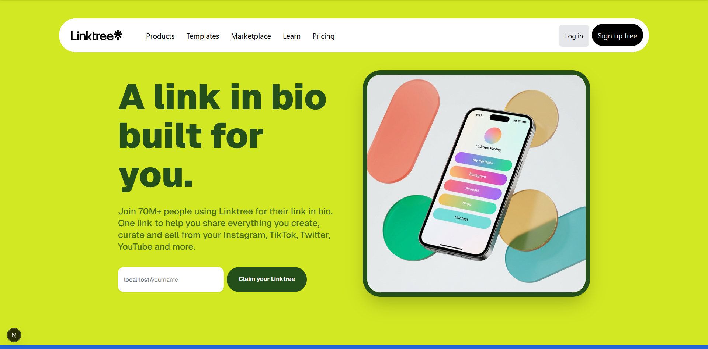

# 🔗 Linktree Clone

A modern **Linktree clone** built with Next.js that allows users to create their own customizable link-in-bio pages. This project replicates core Linktree functionality with a beautiful, premium UI and essential features for managing and sharing multiple links through a single URL.

---

## 📸 Preview

<!-- Add preview image here -->


---

## 🚀 Live Demo

**[View Live Demo](https://linktr-ee-clone-ten.vercel.app/)**

---

## ✨ Features That Work

### ✅ Core Functionality
- **🔐 User Authentication**
  - Complete signup/login system with JWT authentication
  - Secure password hashing with bcryptjs
  - Protected routes and session management
  - Password reset functionality

- **🎨 Beautiful Landing Page**
  - Premium, Linktree-inspired design
  - Responsive hero section with animations
  - Multiple feature sections highlighting customization, sharing, and analytics
  - FAQ section with interactive elements
  - Trust indicators and call-to-action sections
  - Fully responsive footer with app store badges

- **⚙️ Admin Dashboard**
  - Clean, intuitive interface for managing links
  - Add, edit, and delete link collections
  - Live preview of profile (phone mockup)
  - Profile information display (username, bio, avatar)
  - Toggle link visibility (active/inactive)
  - Icon selection for different link types (Instagram, WhatsApp, TikTok, YouTube, etc.)
  - Modern sidebar navigation

- **👤 Public User Profiles**
  - Dynamic route-based user pages (`/[username]`)
  - Display user's active links and profile information
  - Clean, mobile-friendly interface
  - Share profile via unique username URL

- **📱 Responsive Design**
  - Mobile-first approach
  - Works seamlessly across all device sizes
  - Tailwind CSS for modern, utility-first styling

---

## ⚠️ Known Flaws & Missing Features

### 🚧 Incomplete Functionality
- **Analytics Dashboard**
  - Click tracking is not fully implemented
  - No real-time analytics display
  - User engagement metrics are missing

- **Drag & Drop Reordering**
  - UI elements are present but functionality is buggy
  - Links don't properly reorder after drag-and-drop
  - Need to implement proper state management for reordering

- **QR Code Generation**
  - Feature mentioned in UI but not implemented
  - No QR code generation for profile URLs

- **Advanced Profile Customization**
  - Limited theme options (no color picker)
  - No background image upload
  - No custom fonts or advanced styling options

- **Social Media Integration**
  - No actual social media API connections
  - Icons are decorative only

- **Image Upload**
  - No profile picture upload functionality
  - Using placeholders instead

### 🐛 Known Bugs
- Form validation could be more robust
- Some edge cases in authentication flow
- Mobile navigation could be smoother
- Database connection errors not always handled gracefully

---

## 🛠️ Tech Stack

- **Framework:** [Next.js 16.1.1](https://nextjs.org/) (App Router)
- **Frontend:** React 19.2.3
- **Styling:** Tailwind CSS 4
- **Database:** MongoDB (via Mongoose)
- **Authentication:** JWT (jsonwebtoken) + bcryptjs
- **HTTP Client:** Axios
- **Notifications:** react-hot-toast
- **Icons:** react-icons
- **Node Version:** 18+ recommended

---

## 📦 Installation & Setup

### Prerequisites
- Node.js 18 or higher
- MongoDB database (local or cloud)
- npm, yarn, pnpm, or bun package manager

### Steps

1. **Clone the repository**
   ```bash
   git clone <repository-url>
   cd linktree-clone
   ```

2. **Install dependencies**
   ```bash
   npm install
   # or
   yarn install
   # or
   pnpm install
   ```

3. **Set up environment variables**
   
   Create a `.env.local` file in the root directory:
   ```env
   MONGODB_URI=your_mongodb_connection_string
   JWT_SECRET=your_secret_key_here
   NEXT_PUBLIC_HOST=http://localhost:3000
   ```

4. **Run the development server**
   ```bash
   npm run dev
   # or
   yarn dev
   # or
   pnpm dev
   # or
   bun dev
   ```

5. **Open your browser**
   
   Navigate to [http://localhost:3000](http://localhost:3000)

---

## 🗂️ Project Structure

```
linktree-clone/
├── src/
│   ├── app/
│   │   ├── (auth)/          # Authentication pages
│   │   │   ├── login/
│   │   │   ├── signup/
│   │   │   └── forgot/
│   │   ├── (dashboard)/     # Protected admin area
│   │   │   ├── admin/       # Main dashboard
│   │   │   └── AdminSidebar.js
│   │   ├── (main)/          # Landing page
│   │   ├── (public)/        # Public user profiles
│   │   │   └── [username]/
│   │   ├── api/             # API routes
│   │   │   └── users/
│   │   ├── models/          # MongoDB models
│   │   └── helpers/         # Utility functions
│   └── lib/                 # Database connection
├── public/                  # Static assets
└── README.md
```

---

## 🎯 Usage

1. **Create an Account**
   - Navigate to `/signup`
   - Enter your details and create an account

2. **Set Up Your Profile**
   - Go to the admin dashboard
   - Add your bio and profile information
   - Add links with titles and URLs
   - Toggle link visibility

3. **Share Your Profile**
   - Your profile is accessible at `/[your-username]`
   - Share this link on your social media

---

## 🚀 Future Improvements

- [ ] Implement full analytics dashboard
- [ ] Fix drag-and-drop reordering
- [ ] Add QR code generation
- [ ] Implement profile picture upload
- [ ] Add theme customization (colors, fonts)
- [ ] Email verification
- [ ] Social media OAuth login
- [ ] Premium features (scheduling, custom domains)
- [ ] Better error handling and validation
- [ ] Link click tracking
- [ ] SEO optimization for public profiles

---

## 🤝 Contributing

Contributions, issues, and feature requests are welcome! Feel free to check the issues page if you want to contribute.

---

## 📄 License

This project is open source and available for educational purposes.

---

## 🙏 Acknowledgments

- Inspired by [Linktree](https://linktr.ee/)
- Built as a learning project to understand Next.js App Router, MongoDB, and modern web development practices

---

## 📞 Contact

Feel free to reach out if you have any questions or suggestions!

---

**Note:** This is a learning project and not affiliated with Linktree in any way.
